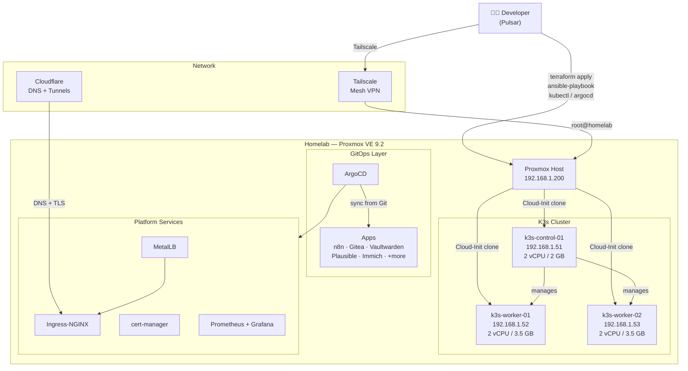

# Project Aether ⚡

> A production-grade homelab Kubernetes platform built on Proxmox - from bare metal to GitOps.

[](infrastructure/terraform)
[](infrastructure/ansible)
[](kubernetes/)
[](infrastructure/secrets)

---

## What is Project Aether?

Project Aether is a self-hosted platform engineering project that migrates 34 Docker Compose services from a single-node setup to a production-grade Kubernetes cluster — with full GitOps, secret management, CI/CD, and observability. Every decision is documented as an ADR and every component is reproducible from code.

---

## Architecture



---

## Tech Stack

| Layer | Tool | Purpose |
|---|---|---|
| **Hypervisor** | Proxmox VE 9.2 | Bare-metal virtualisation |
| **IaC** | Terraform + `bpg/proxmox` v0.113 | VM provisioning from Cloud-Init template |
| **Configuration** | Ansible | K3s installation & cluster bootstrap |
| **Orchestration** | K3s v1.36 | Lightweight Kubernetes |
| **GitOps** | ArgoCD | Declarative app delivery from Git |
| **Ingress** | Ingress-NGINX + MetalLB | Load balancing & routing |
| **TLS** | cert-manager + Cloudflare | Automatic HTTPS |
| **Secrets** | SOPS + age | Encrypted secrets in Git |
| **Networking** | Tailscale | Secure remote access |
| **Automation** | n8n | Workflow automation |
| **Task runner** | Task | `task` commands for every operation |
| **CI** | GitHub Actions | Pre-commit, lint, future CD |

---

## Hardware

> The entire platform runs on a repurposed HP laptop - proof that you don't need a rack to do production-grade infrastructure.

| Component | Spec |
|---|---|
| **Host** | HP Notebook |
| **CPU** | Intel Core i3-5005U · 2 cores / 4 threads · 1.90 GHz |
| **RAM** | 12 GB DDR3 |
| **Storage (OS)** | 250 GB SSD (`sda`) - system disk |
| **Storage (Data)** | 500 GB HDD (`sdb`) - ZFS pool `aether-pool` (464 GiB usable) |
| **OS partition** | 67.7 GB LVM (`pve-root`) |
| **VM storage** | 136.5 GB LVM thin pool (`local-lvm`) + 464 GB ZFS (`aether-storage`) |
| **GPU** | Intel HD Graphics 5500 (integrated, unused) |
| **Network** | Gigabit Ethernet (`vmbr0`) + Tailscale VPN |
| **Hypervisor** | Proxmox VE 9.2 · Kernel 7.0.14-pve |

---

## Repository Structure

```
Project Aether/
├── infrastructure/
│   ├── terraform/          # VM provisioning (Proxmox + Cloud-Init)
│   │   ├── main.tf         # 3 K3s node definitions
│   │   ├── provider.tf     # bpg/proxmox provider
│   │   ├── variables.tf    # Input variables
│   │   ├── outputs.tf      # Node IPs, VMIDs, SSH strings
│   │   └── terraform.tfvars.example
│   ├── ansible/            # K3s cluster bootstrap
│   │   ├── ansible.cfg
│   │   ├── inventory/
│   │   │   └── hosts.yml   # control + workers groups
│   │   └── playbooks/
│   │       ├── common.yml      # Packages, kernel, sysctl
│   │       ├── control.yml     # K3s server install
│   │       ├── workers.yml     # K3s agent join
│   │       └── kubeconfig.yml  # Fetch & patch kubeconfig
│   └── secrets/            # SOPS-encrypted secrets
├── kubernetes/
│   ├── apps/               # ArgoCD Application manifests
│   │   ├── automation/     # n8n
│   │   ├── media/          # Immich, Jellyfin
│   │   └── productivity/   # Gitea, Vaultwarden, Plausible
│   ├── cluster/            # ArgoCD bootstrap (App of Apps)
│   └── system/             # MetalLB, Ingress-NGINX, cert-manager
├── automation/
│   └── n8n-workflows/      # Exported n8n workflow definitions
├── docs/
│   ├── adr/                # Architecture Decision Records
│   ├── runbooks/           # Operational procedures
│   └── planning/           # Progress tracker, gap analysis
├── legacy-docker/          # Archived Docker Compose configs (34 services)
├── Taskfile.yaml           # Task runner — all operations
└── .pre-commit-config.yaml # gitleaks, terraform_fmt, YAML checks
```

---

## Task Reference

```bash
task                    # List all tasks

# Terraform
task tf:init            # terraform init
task tf:plan            # terraform plan
task tf:apply           # terraform apply

# Ansible
task ansible:common     # System prep on all nodes
task ansible:control    # K3s control plane install
task ansible:workers    # K3s worker join
task ansible:kubeconfig # Fetch kubeconfig locally
task ansible:bootstrap  # Run all of the above in order

# Secrets (SOPS)
task encrypt FILE=path/to/secret.yaml
task decrypt FILE=path/to/secret.yaml
```

---

## Documentation

| Document | Description |
|---|---|
| [ADR 005](docs/adr/005-mono-repo-structure.md) | Monorepo structure decision |
| [ADR 006](docs/adr/006%20proxmox%20vm%20provisioning%20strategy.md) | VM provisioning strategy |
| [ADR 007](docs/adr/007-secrets-management.md) | Secrets management (SOPS + age) |
| [ADR 008](docs/adr/008-operational-toolchain.md) | Operational toolchain |
| [Runbook: Cloud-Init Template](docs/runbooks/proxmox-ubuntu-cloudinit-template.md) | Create the base VM template on Proxmox |

---

<div align="center">
  <sub>Built with ☕ and too many late nights by CT</sub>
</div>
